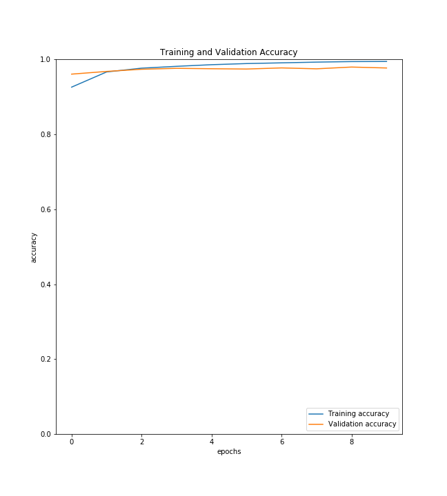

#Digit-Recognizer

## Introduction
The repository contain different types of models that were Build over MINST dataset.

The MNIST dataset contain 60,000 training and 10,000 testing images of size 28X28

## some data from MINST Dataset

## Information about files -
Digit_recognizer_NN - A simple Neural network created for MNIST dataset
	- The model overfits

	- TODO add Aurmentation and Dropouts to check whether model perform well or not
Digit_recognizer_cnn - A convolution Neural Network model created over MINST dataset
	- The model is a little better than simple Neural Network

	- TODO add augmentation an Dropouts to check whether accuracy improves further
